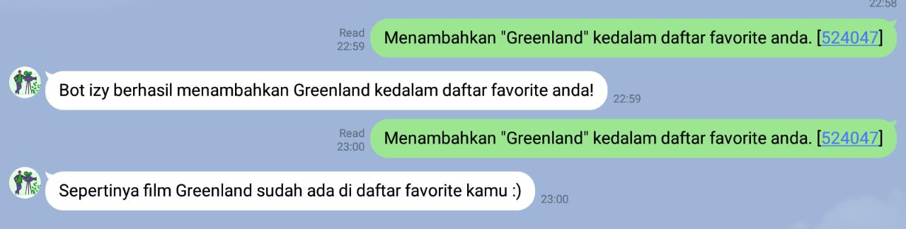

<h1>Description</h1>
<h3>LINE Chatbot app that provide information about Now Playing Movies.</h3> 

    

 

<h1>Tech Stack</h1>
<ul>
    <li><h3>Postgresql</h3></li>
    <li><h3>LINE Messaging API</h3></li>
    <li><h3>Heroku</h3></li>
    <li><h3>Spring Framework</h3></li>
</ul>

 

<h1>API Source</h1>
<h3>https://developers.themoviedb.org/3/</h3>

 

<h1>Screenshot</h1>

- Greeting and On Boarding Message

    

 

- Lihat Daftar Film

    

 

- Add to favorite

    

 

- Handle duplicate favorite

    

 

- Lihat Favorite

    

 

- Handle unknown commands

    

